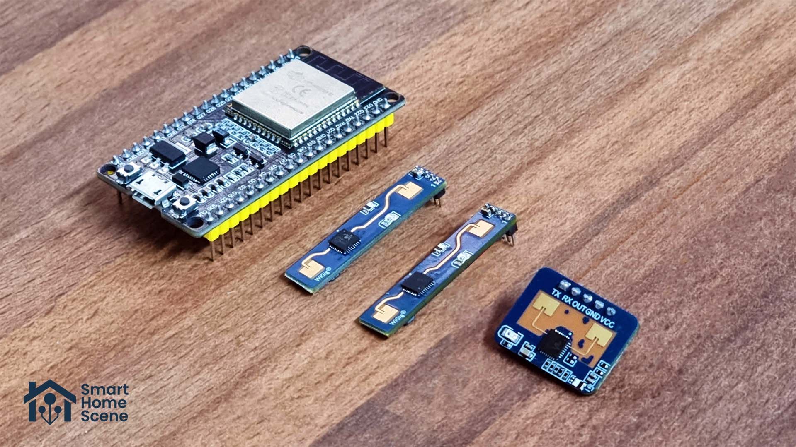
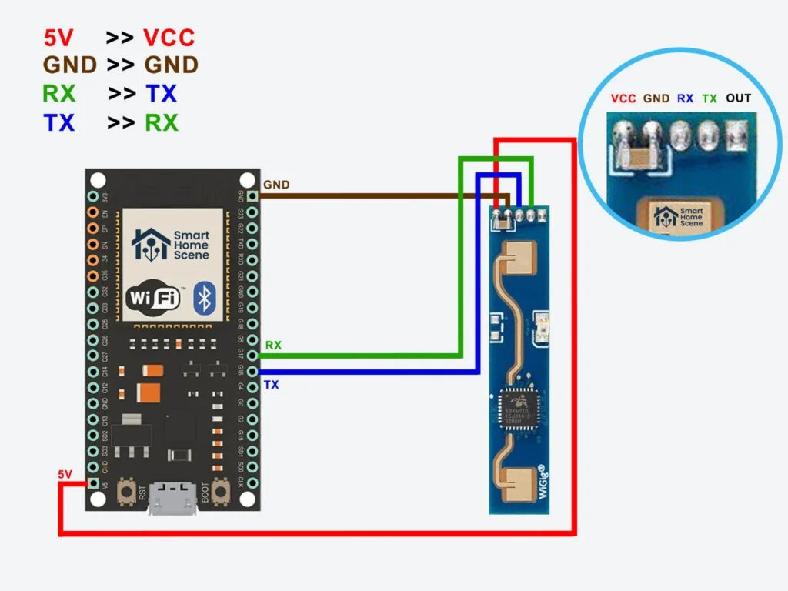
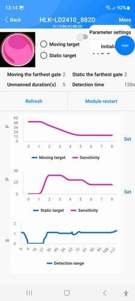

> **Nota (tesi, 28/09/2026)**: in questa copia `acquire.py` (modificato) e `serie.py` sono in
> `../acquisizione/` e i CSV in `../data/`, nella radice del progetto.

# HLK-LD2410B Radar Data Acquisition with ESP32 and Python

This project acquires human-presence data from an **HLK-LD2410B 24 GHz radar sensor** connected to an **ESP32 WROOM-32 development board**.

The ESP32 firmware reads radar data through UART and streams CSV-formatted rows to the computer over USB serial. A Python script reads the serial stream, adds experimental metadata such as scenario, trial ID, group ID, and ground truth, then saves the final dataset as a `.csv` file.

The main goal is to collect experimental data for analysing presence detection quality, including false positives, false negatives, temporal stability, and comparison with an optional PIR sensor.

---

## Project Components

The prototype includes the following components:

- **HLK-LD2410B** 24 GHz human-presence radar sensor;
- **ESP32 WROOM-32 Type-C** development board;
- optional **SSD1306 I2C 128x64 OLED display** for local debugging;
- optional **PIR sensor** used as a baseline for comparison;
- Dupont jumper wires;
- USB cable for ESP32 programming and serial communication;
- Windows or macOS computer for data acquisition;
- PlatformIO firmware located in the `LD2410B/` subfolder;
- Python acquisition script for saving serial data to CSV.

The following image shows the hardware components used in the prototype:



---

## Repository Structure

Recommended project structure:

```text
.
├── README.md
├── acquire.py
├── requirements.txt
├── components.jpg
├── ld2410.jpg
├── data/
└── LD2410B/
    ├── platformio.ini
    └── src/
        └── main.cpp
```

The `LD2410B/` folder contains the PlatformIO firmware project to be uploaded to the ESP32 board.

---

## Hardware Wiring

The HLK-LD2410B radar module is connected to the ESP32 using a UART serial interface.

Recommended wiring:

| HLK-LD2410B | ESP32 |
|---|---|
| VCC | 5V / VIN |
| GND | GND |
| TX | GPIO17 |
| RX | GPIO16 |
| OUT | optional, not required for UART acquisition |

If a PIR sensor is used:

| PIR Sensor | ESP32 |
|---|---|
| VCC | 5V / VIN |
| GND | GND |
| OUT | GPIO23 |

The following image shows the ESP32 pinout and the LD2410B module wiring:



---

## ESP32 Firmware

The ESP32 firmware is located in:

```text
LD2410B/
```

The firmware performs the following tasks:

1. reads data from the HLK-LD2410B radar through UART;
2. optionally reads the PIR sensor state;
3. controls the ESP32 onboard LED;
4. optionally displays live status information on the SSD1306 OLED screen;
5. sends CSV-formatted rows to the computer through the USB serial port.

Example serial output:

```csv
timestamp_ms,radar_presence,moving_target,stationary_target,moving_distance_cm,stationary_distance_cm,moving_energy,stationary_energy,pir_presence
1000,0,0,0,0,0,0,0,0
2000,1,1,0,145,0,72,0,1
3000,1,0,1,0,148,0,55,0
```

---
## Connecting the Board to the Computer

### Windows

Connect the ESP32 to the computer using a USB cable.

To identify the serial port:

1. open **Device Manager**;
2. expand **Ports (COM & LPT)**;
3. look for a port such as:

```text
COM3
COM4
COM5
```

Example:

```text
Silicon Labs CP210x USB to UART Bridge (COM5)
```

In this case, the Python command should use:

```text
COM5
```

### macOS

Connect the ESP32 to the Mac using a USB cable.

Open a terminal and run:

```bash
ls /dev/cu.*
```

To identify the ESP32 port:

1. disconnect the ESP32;
2. run:

```bash
ls /dev/cu.*
```

3. reconnect the ESP32;
4. run the command again:

```bash
ls /dev/cu.*
```

The newly appearing device is the ESP32 serial port.

Typical port names are:

```text
/dev/cu.usbserial-0001
/dev/cu.SLAB_USBtoUART
/dev/cu.wchusbserial1410
/dev/cu.usbmodem1101
```

On macOS, use `/dev/cu.*` ports rather than `/dev/tty.*` ports for this project.

---

## Python Environment Setup

Before running the acquisition script, create and activate a Python virtual environment.

### Windows

Create the virtual environment:

```bash
python -m venv .venv
```

Activate it from PowerShell:

```bash
.venv\Scripts\Activate.ps1
```

Or activate it from Command Prompt:

```bash
.venv\Scripts\activate.bat
```

Install the required dependencies:

```bash
pip install -r requirements.txt
```

If `requirements.txt` is not available, install at least:

```bash
pip install pyserial
```

### macOS

Create the virtual environment:

```bash
python3 -m venv .venv
```

Activate it:

```bash
source .venv/bin/activate
```

Install the required dependencies:

```bash
pip install -r requirements.txt
```

If `requirements.txt` is not available, install at least:

```bash
pip install pyserial
```

---

## Data Acquisition

The Python acquisition script reads CSV rows from the ESP32 serial port and saves them to a `.csv` file.

Example command on Windows:

```bash
python acquire.py --port COM5 --duration 120 --output data/seated_static_T01.csv --scenario seated_static --trial T01 --group G1 --ground_truth_presence 1 --ground_truth_state static
```

Example command on macOS:

```bash
python acquire.py --port /dev/cu.usbserial-0001 --duration 120 --output data/seated_static_T01.csv --scenario seated_static --trial T01 --group G1 --ground_truth_presence 1 --ground_truth_state static
```

Main command-line arguments:

| Argument | Meaning |
|---|---|
| `--port` | serial port connected to the ESP32 |
| `--duration` | acquisition duration in seconds |
| `--output` | output CSV file |
| `--scenario` | experimental scenario |
| `--trial` | trial identifier |
| `--group` | group identifier |
| `--ground_truth_presence` | real presence state: `0` absent, `1` present |
| `--ground_truth_state` | real state: `absent`, `static`, `moving`, `micro_movement`, etc. |

---


## Common Issues

### The serial port does not appear

Check that:

- the USB cable supports data transfer, not only charging;
- the ESP32 board is powered;
- the correct USB-to-serial drivers are installed;
- no other program is already using the serial port.

### The serial monitor shows unreadable characters

Check that the serial monitor speed is:

```text
115200 baud
```

### The radar is not detected

Check the UART wiring:

```text
LD2410B TX -> ESP32 RX
LD2410B RX -> ESP32 TX
```

In the current project configuration:

```text
LD2410B TX -> GPIO17
LD2410B RX -> GPIO16
```

---

## Bluetooth Configuration of the Radar

The **HLK-LD2410B** module can also be configured using a Bluetooth mobile app.

Bluetooth configuration is used to change internal radar parameters such as sensitivity, maximum detection distance, and detection thresholds.

The ESP32 does not need to manage the radar Bluetooth interface. Bluetooth is integrated directly into the HLK-LD2410B module.

For data acquisition, this project uses UART communication between the radar and the ESP32.



---

## Recommended Workflow

```text
1. Configure the HLK-LD2410B radar via Bluetooth app, if needed.
2. Connect the radar, ESP32, optional PIR sensor, and optional OLED display.
3. Upload the PlatformIO firmware from the LD2410B/ folder.
4. Connect the ESP32 to the computer via USB.
5. Identify the serial port.
6. Create and activate the Python virtual environment.
7. Install the Python dependencies.
8. Run acquire.py.
9. Save CSV files in the data/ folder.
10. Analyse the collected data.
```
---

## Uploading the Firmware with PlatformIO (not required if the board is already configured)

The firmware can be uploaded using **PlatformIO** in Visual Studio Code.

### Steps

1. Open Visual Studio Code.
2. Install the **PlatformIO IDE** extension, if not already installed.
3. Open the `LD2410B/` folder as a PlatformIO project.
4. Connect the ESP32 to the computer through USB.
5. Build the firmware:

```bash
pio run
```

6. Upload the firmware to the board:

```bash
pio run --target upload
```

7. Open the serial monitor:

```bash
pio device monitor
```

If everything is working correctly, CSV rows should appear in the serial monitor.

---
